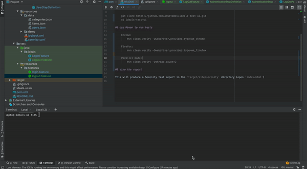

# iDeals test UI with Serenity BDD and Cucumber

## Get the code

Git:

    git clone https://github.com/arustamov/ideals-test-ui.git
    cd ideals-test-ui

## Use Maven to run tests

    Chrome: 
        mvn clean verify -Dwebdriver.provided.type=wm_chrome
        
    Firefox: 
        mvn clean verify -Dwebdriver.provided.type=wm_firefox
        
    Parallel mode:
        mvn clean verify -Dthread.count=2

## View the report

This will produce a Serenity test report in the `target/site/serenity` directory (open `index.html`)
